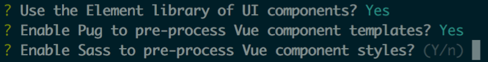

[](https://simulatedgreg.gitbooks.io/electron-vue/content/index.html)

> A fork of the boilerplate for making electron apps built with Vue

> [SimulatedGREG's electron-vue boilerplate](https://github.com/SimulatedGREG/electron-vue) +
  [Element](http://element.eleme.io/) +
  [Pug](https://pugjs.org/) +
  [Sass](http://sass-lang.com/) +
  [Yarn](https://yarnpkg.com/)

This gives you 3 additional
[vue-cli](https://github.com/vuejs/vue-cli) options:


[](https://semaphoreci.com/simulatedgreg/electron-vue)

[](https://github.com/feross/standard)

[](http://forthebadge.com) [](http://forthebadge.com) [](http://forthebadge.com)

## Why use Element, Pug, Sass, and/or Yarn?

These tools make Vue app development easier:

- **[Element](http://element.eleme.io/) provides useful and good-looking UI components**
  - This template includes... Element dependencies and the default Element theme files
  - So you can immediately... use Element components like `<el-date-picker>`
- **[Pug](https://pugjs.org/) makes template tags more readable**
  - This template includes... Pug dependencies
  - So you can immediately... use Pug in Vue component template tags with `<template lang="pug">`
- **[Sass](http://sass-lang.com/) makes style tags more readable**
  - This template includes... Sass dependencies
  - So you can immediately... use Sass in Vue component style tags with `<style lang="sass">`
- **[Yarn](https://yarnpkg.com/) prevents a lot of versioning problems**
  - This template includes... instructions for how to use `yarn` instead of `npm install`
  - So you can immediately... lock down your project dependencies with specific version numbers

## Overview

The aim of this project is to remove the need of manually setting up electron apps using vue. electron-vue takes advantage of `vue-cli` for scaffolding, `webpack` with `vue-loader`, `electron-packager` or `electron-builder`, and some of the most used plugins like `vue-router`, `vuex`, and more.

#### Check out the documentation [here](https://simulatedgreg.gitbooks.io/electron-vue/content/index.html).

Things you'll find in this boilerplate...

* Support for both Vue.js at `2.x.x` and `1.x.x`
* Basic project structure
* Detailed [documentation](https://simulatedgreg.gitbooks.io/electron-vue/content/)
* Project scaffolding using [vue-cli](https://github.com/vuejs/vue-cli)
* Ready to use Vue plugins \([vue-electron](https://github.com/SimulatedGREG/vue-electron),  [vue-resource](https://github.com/vuejs/vue-resource), [vue-router](https://github.com/vuejs/vue-router), [vuex](https://github.com/vuejs/vuex)\)\*
* Installed [vue-devtools](https://github.com/vuejs/vue-devtools) and [devtron](https://github.com/electron/devtron) tools for development
* Ability to easily package your electron app using [electron-packager](https://github.com/electron-userland/electron-packager) or [electron-builder](https://github.com/electron-userland/electron-builder)*
* Handy [NPM scripts](npm_scripts.md)
* Use of [webpack](https://github.com/webpack/webpack) and [vue-loader](https://github.com/vuejs/vue-loader) with Hot Module Replacement
* HTML/CSS/JS pre-processor support with [vue-loader](https://github.com/vuejs/vue-loader/)
* ES6 with [`stage-0`](https://babeljs.io/docs/plugins/preset-stage-0/) by default
* ESLint \(with support for [`standard`](https://github.com/feross/standard) and [`airbnb-base`](https://github.com/airbnb/javascript)\)\*
* Unit Testing \(with Karma + Mocha\)\*
* End-to-end Testing \(with Spectron + Mocha\)\*

\*Customizable during vue-cli scaffolding

### Getting Started

This boilerplate was built as a template for [vue-cli](https://github.com/vuejs/vue-cli) and includes options to customize your final scaffolded app. Certain dependencies and scripts use ES6 specific features so the use of `node@^6.5.0` or higher is recommended.

```bash
# Install vue-cli and scaffold boilerplate
npm install -g vue-cli
vue init JauntyTech/electron-vue-plus my-project

# Install dependencies and run your app
cd my-project
yarn
npm run dev
```

##### Wanting to use Vue 1?

Just point to the `1.0` branch. Please note that electron-vue has officially deprecated `vue@^1` and documentation reflects those changes. Use the [**legacy documentation**](https://github.com/SimulatedGREG/electron-vue/tree/1.0/docs) if you are using Vue 1.

```bash
vue init JauntyTech/electron-vue-plus#1.0 my-project
```

##### Are you a Windows User?

Make sure to check out [**A Note for Windows Users**](https://simulatedgreg.gitbooks.io/electron-vue/content/docs/getting_started.html#a-note-for-windows-users) to make sure you have all the necessary build tools needed for electron and other dependencies.

### Next Steps

Make sure to take a look at the [documentation](https://simulatedgreg.gitbooks.io/electron-vue/content/). Here you will find useful information about configuration, project structure, and building your app. There's also a handy [FAQs](https://simulatedgreg.gitbooks.io/electron-vue/content/docs/faqs.html) section.

### Future Plans

Be up to date with new features and improvements by checking on the [GitHub Project](https://github.com/SimulatedGREG/electron-vue/projects/2).

### Contributing

Wanting to submit a pull request? Make sure to read [this](docs/contributing.md) first.
